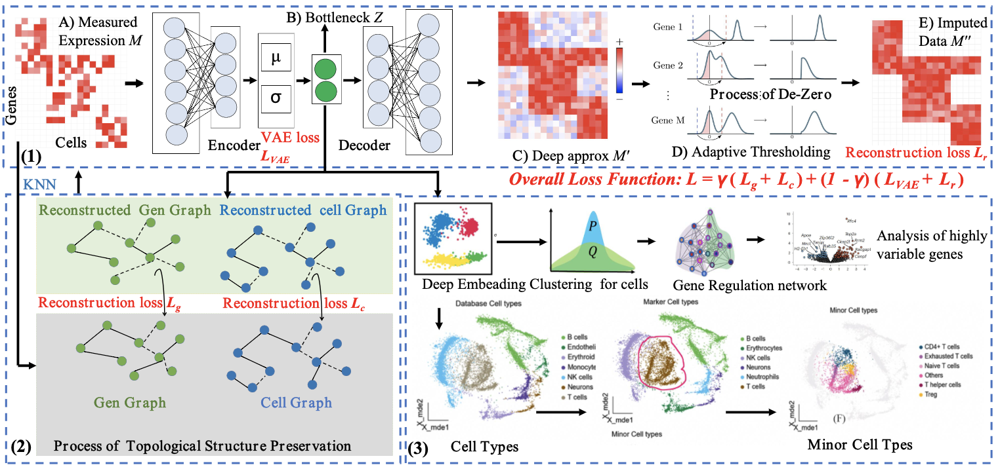

# scIMTA
`scIMTA` is a Python package containing tools for clustering single-cell data based on a graph-embedding autoencoder that simultaneously learns cell–cell topology representation and cluster assignments.

- [Overview](#overview)
- [System Requirements](#system-requirements)
- [Installation Guide](#installation-guide)
- [Usage](#Usage)
- [Data Availability](#data-availability)
- [License](#license)




# System Requirements
## Hardware requirements
`scIMTA` package requires only a standard computer with enough RAM to support the in-memory operations.

## Software requirements
### OS Requirements
The package has been tested on the following systems:
+ Linux: Ubuntu 18.04
+ Windows
+ MacOS

### Python Dependencies
`scIMTA` mainly depends on the Python scientific stack.
```
numpy
scipy
tensorflow
scikit-learn
pandas
scanpy
anndata
```
For specific setting, please see <a href="https://github.com/ShengPengYu/scIMTA/blob/master/requirements.txt">requirement</a>.

# Installation Guide:

### Install from PyPi

```
$ conda create -n scIMTA_env python=3.6.8
$ conda activate scIMTA_env
$ pip install -r requirements.txt
$ pip install scIMTA
```

# Usage
`scIMTA` is a deep graph embedding learning method for single-cell clustering, which can be used to:
+ Single-cell data clustering. The example can be seen in the <a href="https://github.com/ShengPengYu/scIMTA/blob/master/tutorial/demo.py">demo.py</a>.
+ Correct the batch effect of data from different scRNA-seq protocols. The example can be seen in the <a href="https://github.com/ShengPengYu/scIMTA/blob/master/tutorial/demo_batch.py">demo_batch.py</a>.
+ Analysis of the mouse brain data with 1.3 million cells. The example can be seen in the <a href="https://github.com/ShengPengYu/scIMTA/blob/master/tutorial/demo_scale.py">demo_scale.py</a>.
+ Provide an automatic hyperparameter search algorithm. The example can be seen in the <a href="https://github.com/ShengPengYu/scIMTA/blob/master/tutorial/demo_para.py">demo_para.py</a>.

We give users some suggestions for running in the <a href="https://github.com/ShengPengYu/scIMTA/blob/master/tutorial/tutorial.md">tutorial.md</a>.


# Data Availability

The real data sets we used can be download in https://pan.baidu.com/s/1oRdGQR58KEklzz6qXZXHug?pwd=8yjy code: 8yjy 


